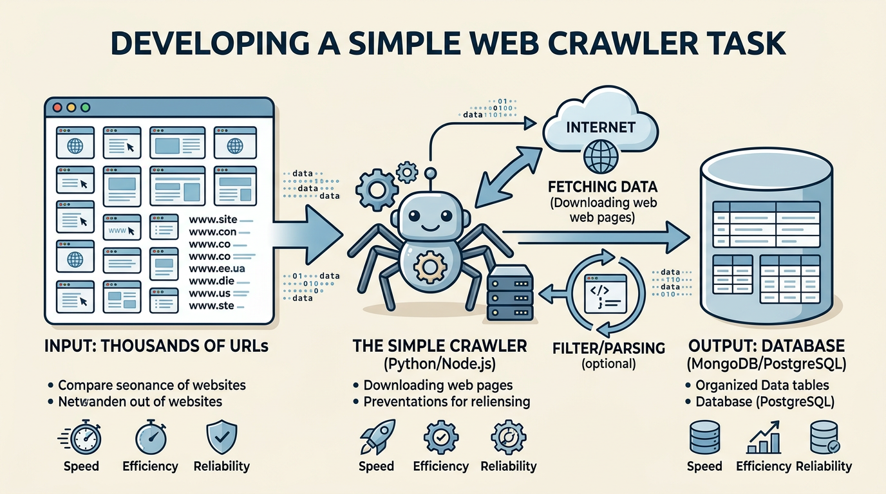
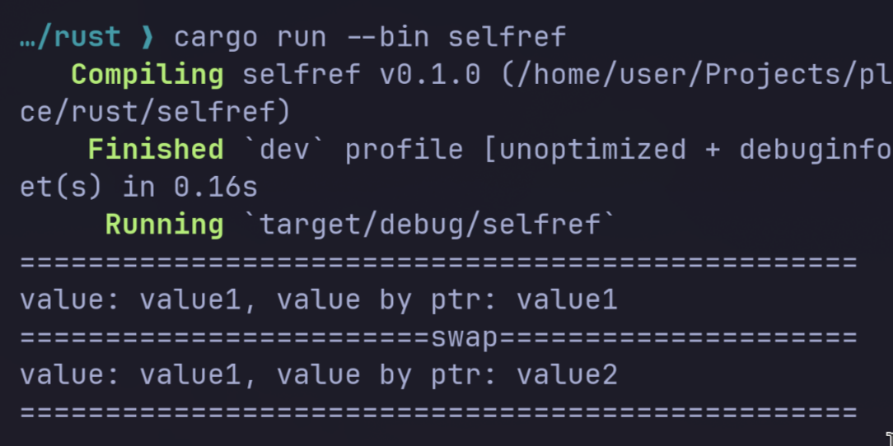
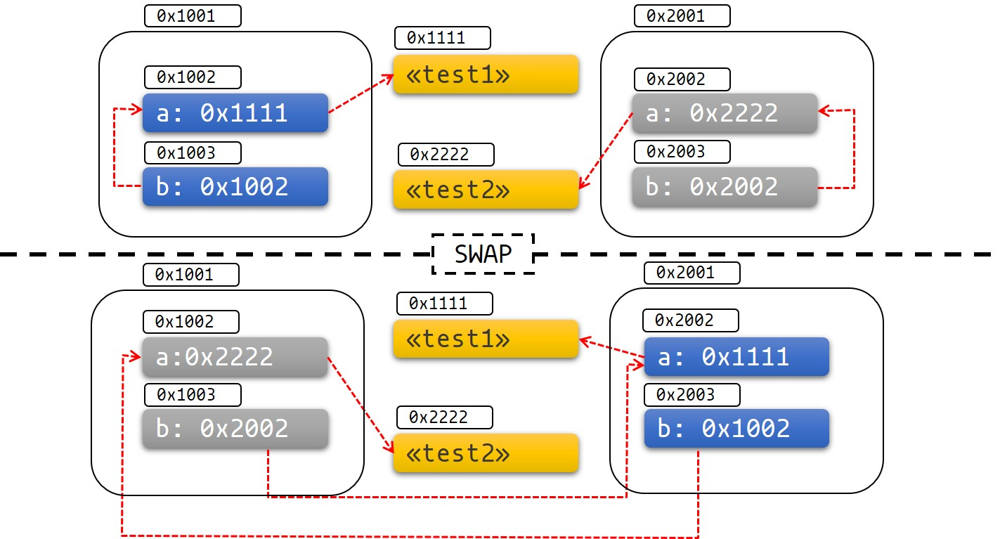
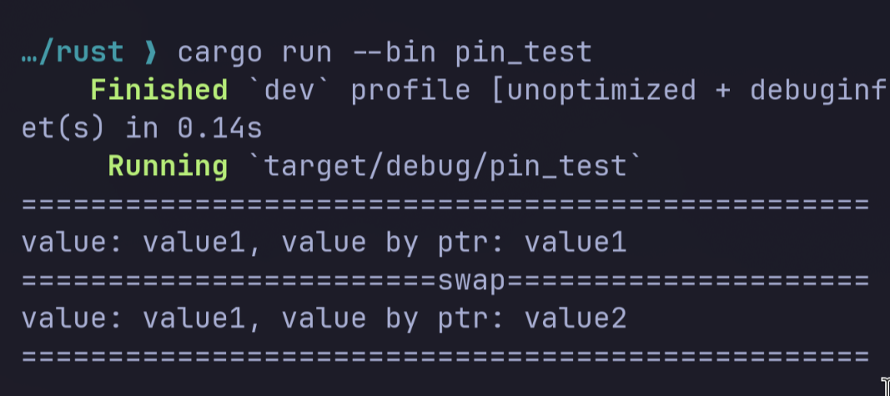
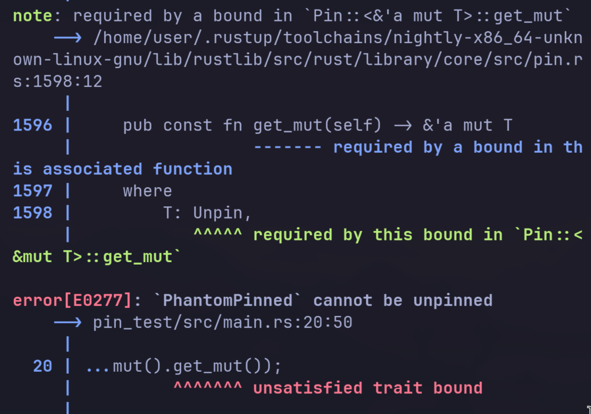

---
# try also 'default' to start simple
theme: seriph
# random image from a curated Unsplash collection by Anthony
# like them? see https://unsplash.com/collections/94734566/slidev
background: ./images/start.png
# some information about your slides (markdown enabled)
title: Welcome to Slidev
info: |
  ## Slidev Starter Template
  Presentation slides for developers.

  Learn more at [Sli.dev](https://sli.dev)
# apply UnoCSS classes to the current slide
class: text-center
# https://sli.dev/features/drawing
drawings:
  persist: false
# slide transition: https://sli.dev/guide/animations.html#slide-transitions
transition: slide-left
# enable Comark Syntax: https://comark.dev/syntax/markdown
comark: true
# duration of the presentation
duration: 35min
---

# ASYNC RUST

---
transition: fade-out
layout: image-right
image: ./images/atlas.jpg
---

# $ whoami

<ul>
  <li>Tech Lead at <strong>ATLAS</strong></li>
  <li>
    Senior Go and Rust Developer
    <ul>
      <li>7 years of experience in Go</li>
      <li>6 years of experience in Rust</li>
    </ul>
  </li>
  <li>
    Instructor at YSDA
  </li>
</ul>

---

# Crawler



---

# Async Crawler

Using tokio runtime with async/await syntax

```rust {all|1-9|11-27|all}
async fn crawl() {
    println!("Fetching page...");

    let mut page = [0u8; 16];
    (async |mut page: &mut [u8]| {
        time::sleep(Duration::from_secs(3)).await;
        page.write(b"Hello, world").unwrap();
    })(&mut page)
    .await;

    println!("Storing to database...");
    time::sleep(Duration::from_secs(3)).await;
    println!(r"INSERT ( {} )", str::from_utf8(&page).unwrap());
    println!("Done!");
}
```

---
transition: fade-out
layout: center
---

# \#\!\[forbid(async/await)\]

---

# Future

Std future

```rust
pub enum Poll<T> {
    Ready(T),
    Pending,
}

pub trait Future {
    type Output;

    // Required method
    fn poll(self: Pin<&mut Self>, cx: &mut Context<'_>) -> Poll<Self::Output>;
}
```

---

# Non-blocking Crawler - FutureResult

Poll enum replacement

```rust
pub enum FutureResult<T> {
    Pending,
    Ready(T),
}
```

Non-blocking sleep function?

---

# Non-blocking Crawler - FutureResult

Poll enum replacement

```rust
pub enum FutureResult<T> {
    Pending,
    Ready(T),
}
```
```rust
time::Instant::now() < self.deadline
```

---

# Async time in Tokyo

```rust {all|8|all}
pub(crate) fn poll(&mut self, now: u64) -> Option<TimerHandle> {
    loop {
        if let Some(handle) = self.pending.pop_back() {
            return Some(handle);
        }

        match self.next_expiration() {
            Some(ref expiration) if expiration.deadline <= now => {
                self.process_expiration(expiration);

                self.set_elapsed(expiration.deadline);
            }
            _ => {
                self.set_elapsed(now);
                break;
            }
        }
    }

    self.pending.pop_back()
}
```

---

# Non-blocking Crawler - FetchingPageFuture

Deadline-based polling

```rust {all|1-3|5-10|12-19|all}
pub struct FetchingPageFuture {
    deadline: time::Instant,
}

impl FetchingPageFuture {
    pub fn new() -> FetchingPageFuture {
        FetchingPageFuture {
            deadline: time::Instant::now().add(Duration::from_secs(3)),
        }
    }

    pub fn poll(&mut self, mut page: &mut [u8]) -> FutureResult<()> {
        if time::Instant::now() < self.deadline {
            return FutureResult::Pending;
        }

        page.write(b"Hello, world").unwrap();
        FutureResult::Ready(())
    }
}
```

---

# Non-blocking Crawler - StoringFuture

Database storage simulation

```rust {all|1-3|5-10|12-19|all}
pub struct StoringFuture {
    deadline: time::Instant,
}

impl StoringFuture {
    pub fn new() -> StoringFuture {
        StoringFuture {
            deadline: time::Instant::now().add(Duration::from_secs(6)),
        }
    }

    pub fn poll(&mut self, page: &[u8]) -> FutureResult<()> {
        if time::Instant::now() < self.deadline {
            return FutureResult::Pending;
        }

        println!(r"INSERT ( {} )", str::from_utf8(&page).unwrap());
        FutureResult::Ready(())
    }
}
```

---
layout: center
---

# Combine futures?

---

# Non-blocking Crawler - CrawlFuture 1

State machine implementation

```rust {all|1-5|7-12|14-42|all}
pub enum State {
    FetchPage,
    StoringToDatabase,
    Done,
}

pub struct CrawlFuture {
    state: State,
    fetching_page_fut: FetchingPageFuture,
    storing_db_fut: StoringFuture,
    page: [u8; 16],
}

impl CrawlFuture {
    pub fn new() -> CrawlFuture {
        CrawlFuture {
            state: State::FetchPage,
            fetching_page_fut: FetchingPageFuture::new(),
            storing_db_fut: StoringFuture::new(),
            page: [0; 16],
        }
    }
```

---

# Non-blocking Crawler - CrawlFuture 2

```rust
pub fn poll(&mut self) -> FutureResult<()> {
        match self.state {
            State::FetchPage => {
                println!("Fetching page...");
                match self.fetching_page_fut.poll(&mut self.page) {
                    FutureResult::Pending => FutureResult::Pending,
                    FutureResult::Ready(_) => {
                        self.state = State::StoringToDatabase;
                        FutureResult::Pending
                    }
                }
}
```

---

# Non-blocking Crawler - CrawlFuture 3

```rust
            State::StoringToDatabase => {
                println!("Storing to database...");
        match self.storing_db_fut.poll(&self.page) {
            FutureResult::Pending => FutureResult::Pending,
            FutureResult::Ready(_) => {
                self.state = State::Done;
                    FutureResult::Pending
                }
            }
        }
        State::Done => {
            println!("Done!");
            FutureResult::Ready(())
        }
    }
```

---

# Non-blocking Crawler - Main

Manual future polling without async runtime

```rust
fn main() {
    let mut fetchers = Vec::new();
    for _ in 1..10000 {
        fetchers.push(CrawlFuture::new());
    }

    loop {
        let mut all_ready = true;

        for fetcher in &mut fetchers {
            match fetcher.poll() {
                FutureResult::Pending => all_ready = false,
                FutureResult::Ready(_) => (),
            }
        }

        if all_ready {
            break;
        }
        thread::sleep(Duration::from_millis(100));
    }
}
```

---

# Any problem?

```rust
pub trait Future {
    type Output;

    fn poll(self: Pin<&mut Self>, cx: &mut Context<'_>) -> Poll<Self::Output>;
}
```

---

# Wake up problem

```rust
loop {
    ...
    thread::sleep(Duration::from_millis(100));
}
```
```rust
pub struct Context<'a> {
    waker: &'a Waker,
    local_waker: &'a LocalWaker,
}
```
```rust
impl Waker {
    pub fn wake(self) {
```

---

# Unification problem

```rust
pub trait Future {
    type Output;

    fn poll(self: Pin<&mut Self>, cx: &mut Context<'_>) -> Poll<Self::Output>;
}
```
```rust
fn poll(&mut self) -> FutureResult<()>
fn poll(&mut self, mut page: &mut [u8]) -> FutureResult<()>
fn poll(&mut self, page: &[u8]) -> FutureResult<()>
```

---

# Unification problem - solution?

```rust
fn poll(&mut self) -> FutureResult<()>
fn poll(&mut self, mut page: &mut [u8]) -> FutureResult<()>
fn poll(&mut self, page: &[u8]) -> FutureResult<()>
```
```rust {all|1-4|6-11|all}
struct FetchingPageFuture<'a> {
    deadline: time::Instant,
    page: &'a mut [u8]
}

struct CrawlFuture {
    state: State,
    fetching_page_fut: FetchingPageFuture<'?>, // what lifetime should we specify?
    storing_db_fut: StoringFuture,
    page: [u8; 16],
}
```

---
transition: fade-out
layout: center
---

# Self-Referential Struct and Pin

---

# Self-Referential Struct - Definition

The problem with self-referential data

```rust
pub struct SelfRef {
    value: String,
    value_ptr: *const String,
}
```
---

# Self-Referential Struct - Impl

```rust {all|2-7|8-12|14-16|18-21|all}
impl SelfRef {
    pub fn new(value: &str) -> Self {
        SelfRef {
            value: String::from(value),
            value_ptr: std::ptr::null(),
        }
    }

    pub fn init(&mut self) {
        let value_ptr: *const String = &self.value;
        self.value_ptr = value_ptr;
    }

    pub fn value(&self) -> &str {
        &self.value
    }

    pub fn value_by_ptr(&self) -> &str {
        assert!(!self.value_ptr.is_null(), "SelfRef called without being set_ptr called first");
        unsafe { &*(self.value_ptr) }
    }
}
```

---

# Self-Referential Struct - Usage

Demonstrating the swap problem

```rust {all|1-5|7-8|10|12-13|all}
fn main() {
    let mut s1 = SelfRef::new("value1");
    let mut s2 = SelfRef::new("value2");
    s1.init();
    s2.init();

    println!("=================================================");
    println!("value: {}, value by ptr: {}", s1.value(), s1.value_by_ptr());

    mem::swap(&mut s1, &mut s2);
    println!("========================swap=====================");

    println!("value: {}, value by ptr: {}", s2.value(), s2.value_by_ptr());
    println!("=================================================");
}
```

---

# Swap result



<v-click>

⚠️ After swap, `value_by_ptr()` returns wrong value!

</v-click>

---

# Swap problem



---
transition: fade-out
---

# SelfRef with Pin - Definition

Using Pin to prevent moves

```rust
pub struct SelfRef {
    value: String,
    value_ptr: *const String,
}
```

---

# SelfRef with Pin - Impl

Using Pin to prevent moves

```rust {all|6-11|15-19|all}
impl SelfRef {
    pub fn new(value: &str) -> Self {
        SelfRef { value: String::from(value), value_ptr: std::ptr::null() }
    }

    pub fn init(self: Pin<&mut Self>) {
        let value_ptr: *const String = &self.value;
        // SAFETY: the data will never move out of this reference in this function
        let this = unsafe { self.get_unchecked_mut() };
        this.value_ptr = value_ptr;
    }

    pub fn value(&self) -> &str { &self.value }

    pub fn value_by_ptr(&self) -> &str {
        assert!(!self.value_ptr.is_null(), "SelfRef called without being set_ptr called first");
        unsafe { &*(self.value_ptr) }
    }
}
```

---

# Pin - Usage

Safe usage with Pin

```rust {all|2-3|all}
fn main() {
    let mut s1 = pin!(SelfRef::new("value1"));
    let mut s2 = pin!(SelfRef::new("value2"));
    s1.as_mut().init();
    s2.as_mut().init();

    println!("=================================================");
    println!(
        "value: {}, value by ptr: {}",
        s1.as_ref().value(),
        s1.value_by_ptr()
    );

    mem::swap(s1.as_mut().get_mut(), s2.as_mut().get_mut());
    println!("========================swap=====================");

    println!("value: {}, value by ptr: {}", s2.value(), s2.value_by_ptr());
    println!("=================================================");
}
```

---

# Pin - Macros

```rust {all|5|all}
pub macro pin($value:expr $(,)?) {
    {
        super let mut pinned = $value;
        // SAFETY: The value is pinned: it is the local above which cannot be named outside this macro.
        unsafe { $crate::pin::Pin::new_unchecked(&mut pinned) }
    }
}
```

---

# Pin - Result?



<v-click>

⚠️ Pin doesn't save you without Pin trait-marker

</v-click>

---

# Pin - Unpin

```rust
pub const fn get_mut(self) -> &'a mut T
where
    T: Unpin,
{
    self.pointer
}

pub struct PhantomPinned;
impl !Unpin for PhantomPinned {}
```
```rust
pub struct SelfRef {
    value: String,
    value_ptr: *const String,
    _marker: PhantomPinned,
}
```

---

# Pin - Correct usage



<v-click>

✅ Pin ensures the struct cannot be moved after initialization

</v-click>

---
transition: fade-out
layout: center
---

# Compilation

---

# Simple coroutine

```rust
fn main() {
    let mut coroutine = #[coroutine]
    || {
        yield 1;
        yield 25;
        return "foo";
    };

    loop {
        match Pin::new(&mut coroutine).resume(()) {
            CoroutineState::Yielded(x) => println!("{}", x),
            CoroutineState::Complete(x) => {
                println!("{}", x);
                break;
            }
        }
    }
}
```

---
layout: center
class: text-center
---

# Thank You!

Questions?
